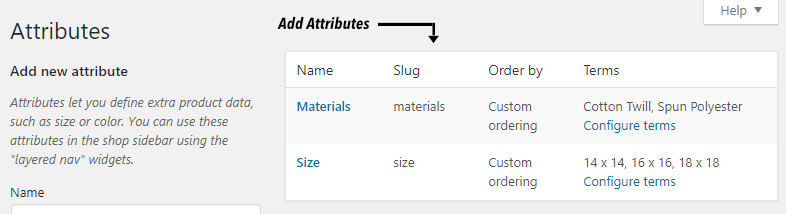
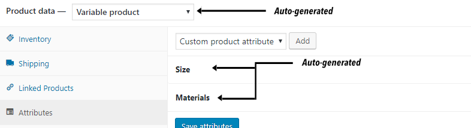
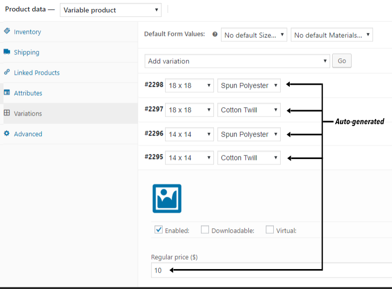

# Programmatically add a New Product with Attributes and Variations in Woocommerce #
>When adding a new product, the features and variations are automatically created.

## Getting started ##
Create new attributes in attributes page in Wordpress admin panel first.



Then find the file named functions.php in your Wordpress theme and add our [code](functions.php).

Add the attributes you created to the file as appropriate.
```php
$attributes = array(
  array("name"=>"Size","options"=>array("14 x 14","16 x 16","18 x 18"),"position"=>1,"visible"=>1,"variation"=>1),
  array("name"=>"Materials","options"=>array("Cotton Twill","Spun Polyester"),"position"=>2,"visible"=>1,"variation"=>1)
);
```
After Add the variations you created to the file as appropriate and save functions.php file.
```php
$variations = array(
  array("regular_price"=>"10","price"=>"","sku"=>"","attributes"=>array(array("name"=>"Size","option"=>"14 x 14"),array("name"=>"Materials","option"=>"Cotton Twill")),"manage_stock"=>"","stock_quantity"=>"8"),
  array("regular_price"=>"12","price"=>"","sku"=>"","attributes"=>array(array("name"=>"Size","option"=>"14 x 14"),array("name"=>"Materials","option"=>"Spun Polyester")),"manage_stock"=>"","stock_quantity"=>"8"),
  array("regular_price"=>"14","price"=>"","sku"=>"","attributes"=>array(array("name"=>"Size","option"=>"18 x 18"),array("name"=>"Materials","option"=>"Cotton Twill")),"manage_stock"=>"","stock_quantity"=>"2"),
  array("regular_price"=>"16","price"=>"","sku"=>"","attributes"=>array(array("name"=>"Size","option"=>"18 x 18"),array("name"=>"Materials","option"=>"Spun Polyester")),"manage_stock"=>"","stock_quantity"=>"2")
);
```
Now create a new product.

### Click Attributes Tab ###


### Click Variations Tab ###


Attributes and variations are added when you publish the new product.
